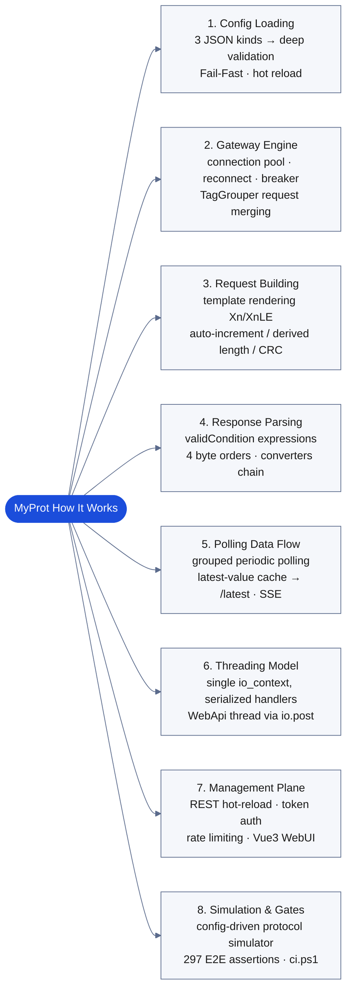

# MyProt — Config-Driven Protocol Gateway

**English** | [简体中文](README.zh.md)

📖 Docs: [English](docs/en/README.md) · [中文](docs/README.md) ｜ Contributing: [Guide](CONTRIBUTING.en.md) · [参与贡献](CONTRIBUTING.md)

A **pure config-driven industrial protocol gateway** in C++11. Every communication behavior is defined by JSON configuration files — the engine only interprets and executes, with zero protocol-specific hardcoding. Loading a different JSON config adds support for Modbus TCP, Siemens S7, SEER, or any binary/text protocol: **"definition is execution"**.

> Design docs (architecture, modules, ADRs) live in [docs/en/README.md](docs/en/README.md) — an English mirror of the authoritative Chinese docs; architecture, protocols and the config schema are translated, while some deep-dive pages (modules, ADRs) are still Chinese-only (marked *zh* in the index).
> The first-generation prototype is archived under [archive/MyProtCpp/](archive/MyProtCpp/) and no longer maintained.

---

## Project Layout

```
MyProt-master/
├── MyProt.sln          # Visual Studio solution (main build entry)
├── src/
│   ├── Core/           # Expected<T,E>/Optional/ByteView/ByteOrder value types + config POCOs
│   ├── Transport/      # IChannel abstraction + TCP/TLS/serial channels, LengthField/Silence framing
│   ├── Engine/         # RequestBuilder / ResponseParser / ExpressionEvaluator (type conversion lives in ResponseParser::Parse)
│   ├── Service/        # Config store, deep validation, directory loading, session circuit breaker
│   ├── Gateway/        # ProtocolGateway facade, ChannelManager pool, TagReader, TagGrouper
│   ├── Polling/        # Grouped polling engine, latest-value cache (results go straight to consumers)
│   ├── WebApi/         # REST management plane (auth middleware)
│   ├── Simulation/     # Config-driven protocol simulator (response synthesis, template matching)
│   └── App/            # main.cpp entry + RuntimeGlue shared by production and tests
├── tests/              # Unit test projects (Core/Engine/Transport.Tests)
├── src/Tests/          # MyProt.E2E — end-to-end tests as a separate process
├── configs/            # Runtime config: protocols/*.json + tags.json
├── scripts/            # Build & environment scripts
├── third_party/        # asio (VS2015-compatible build) and other third-party libraries
├── docs/               # Design docs, module references, ADRs
└── archive/            # Archived: first-gen prototype (MyProtCpp), legacy protocol samples
```

---

## Quick Start

### Requirements

- Visual Studio 2015 or newer (v140 toolset, C++11)
- Windows SDK 8.1+

### Build & Run

1. Open `MyProt.sln` in Visual Studio, build the full solution for Debug/Release × x64
2. Run `build\Debug\x64\bin\MyProt.App.exe`
   - No arguments = start the gateway with the default `configs/` directory (Web API on port 8080)
   - `--config <dir>` selects a config directory; `--port N` sets the Web API port
3. Run end-to-end tests: execute `MyProt.E2E.exe` from the same directory
4. One-shot regression gate (Release x64 build + 4 unit test suites + E2E; any failure exits non-zero — see [ADR-0013](docs/adr/0013-infrastructure-admission.md)):
   ```bat
   powershell -ExecutionPolicy Bypass -File scripts\ci.ps1
   ```

### Simulation Testing

```bash
# Terminal 1: start the protocol simulator slave (built together with the App)
MyProt.App.exe --config configs_write_test

# Terminal 2: exercise the write path through the Web API
# See docs/en/architecture/06_Extension_and_Simulation.md
```

---

## Core Capabilities

| Capability | Description |
|------|------|
| **Request building** | Fixed hex, variable placeholders, built-in functions (auto-increment IDs, length computation, string templates `${...}`) |
| **Channel abstraction** | Unified TCP/TLS/serial, LengthField / Fixed framing modes |
| **Response validation** | Expression checks (e.g. `resp[7] == 0x03`) via a recursive-descent evaluator |
| **Data extraction** | Dynamic segment extraction with four byte orders (ABCD/DCBA/CDAB/BADC) and type conversion |
| **Concurrency control** | Per-device connection pool + session circuit breaker (Closed/Open/HalfOpen), timeout-retry time budget |
| **Management plane** | REST API with config hot-reload, metrics, token auth |

Single source of truth for the config schema: [docs/en/Config_Schema.md](docs/en/Config_Schema.md).

## How It Works

At startup the system loads its configuration; at runtime the engine **interprets** templates — every communication behavior comes from `configs/*.json`, with zero protocol hardcoding in the engine ("definition is execution"):



> Threading and data-flow details: [docs/en/architecture/03_Threading_and_DataFlow.md](docs/en/architecture/03_Threading_and_DataFlow.md); config grammar: [docs/en/Config_Schema.md](docs/en/Config_Schema.md).

---

## Supported Protocols

| Protocol | Transport | Framing | Config file |
|------|--------|--------|----------|
| Modbus TCP | TCP | LengthField (2B big-endian) | `configs/protocols/modbus-tcp.json` |
| S7 (Siemens) | TCP | COTP handshake + LengthField | `configs/protocols/s7-1200.json` |
| Omron FINS/TCP | TCP | LengthField (4B big-endian @0) | `configs/protocols/omron-fins-tcp.json` |
| Mitsubishi MC 3E | TCP | LengthField (2B little-endian @7) | `configs/protocols/mitsubishi-mc-3e.json` |
| Beckhoff ADS/AMS | TCP | LengthField (4B little-endian @2) | `configs/protocols/twincat-ads.json` |
| SEER (AGV, JSON payload) | TCP | LengthField (4B) + JSON data | `configs/protocols/seer.json` (tutorial: [docs/en/protocols/seer.md](docs/en/protocols/seer.md)) |

Adding a protocol = dropping a JSON file into `configs/protocols/` and referencing it from `tags.json` — a restart makes it live, no code changes. Little-endian fields use the `{Name:XnLE}` placeholder directly (LSB first, no hand-written byte-swap formulas; E2E Test 22 verifies FINS/MC 3E/ADS byte-for-byte).

---

## Tech Stack

- **Language**: C++11 (hard-constrained to VS2015/v140 — see ADR-0010)
- **Networking**: asio (VS2015-compatible copy bundled in third_party)
- **JSON**: nlohmann/json (header-only)
- **Infrastructure**: in-house `Expected<T,E>` / `Optional<T>` / `ByteView` replacing C++17 facilities

---

## Trademarks

MODBUS® (Schneider Electric), SIEMENS / S7 (Siemens AG), OMRON (Omron Corporation), Mitsubishi / MELSEC (Mitsubishi Electric Corporation), TwinCAT / ADS (Beckhoff Automation), and SEER are trademarks of their respective owners. This project is not affiliated with, endorsed by, or certified by any of these vendors; the names are used solely to describe interoperability with their published or de-facto-standard communication protocols. Provenance notes for each protocol's byte conventions live in the `_provenance` field of the corresponding config file.

---

## License

MIT
