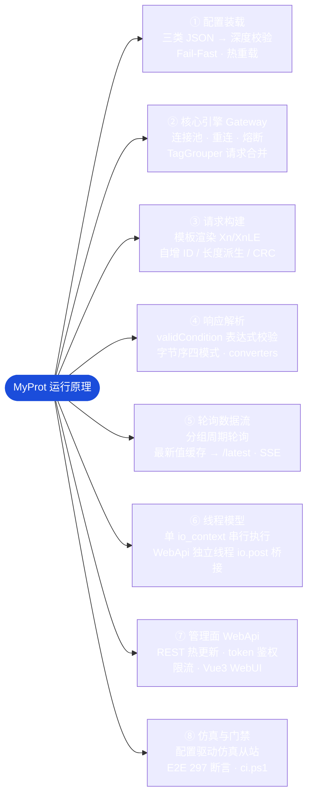

# MyProt — 通用协议网关

[简体中文](README.zh.md) | **[English](README.md)**

📖 文档 Docs: [中文](docs/README.md) · [English](docs/en/README.md) ｜ 贡献 Contributing: [参与贡献](CONTRIBUTING.md) · [Guide](CONTRIBUTING.en.md)

**纯配置驱动的工业协议网关**，所有通信行为由 JSON 配置文件定义，引擎仅负责解释执行，不含任何特定协议的硬编码。通过加载不同的 JSON 配置，即可支持 ModbusTCP、S7、SEER（仙工）及任意二进制/文本协议，真正做到 **"定义即执行"**。

> 详细设计文档见 [docs/README.md](docs/README.md)（架构、模块、ADR 决策记录）。
> 第一代单项目原型已归档至 [archive/MyProtCpp/](archive/MyProtCpp/)，不再维护。

---

## 项目结构

```
MyProt-master/
├── MyProt.sln          # VS 解决方案（主构建入口）
├── src/
│   ├── Core/           # Expected<T,E>/Optional/ByteView/ByteOrder 值类型与配置 POCO
│   ├── Transport/      # IChannel 抽象 + TCP/TLS/串口通道、LengthField/Silence 成帧
│   ├── Engine/         # RequestBuilder / ResponseParser / ExpressionEvaluator（类型转换下沉至 ResponseParser::Parse）
│   ├── Service/        # 配置存储、深度校验、目录加载、会话熔断
│   ├── Gateway/        # ProtocolGateway 门面、ChannelManager 连接池、TagReader、TagGrouper
│   ├── Polling/        # 分组轮询引擎、最新值缓存（结果回调直送消费者）
│   ├── WebApi/         # REST 管理面（鉴权中间件）
│   ├── Simulation/     # 协议仿真从站（响应合成、模板匹配）
│   └── App/            # main.cpp 入口与生产/测试共享胶水层 RuntimeGlue
├── tests/              # 单元测试工程（Core/Engine/Transport.Tests）
├── src/Tests/          # MyProt.E2E — 端到端测试独立进程
├── configs/            # 运行配置：protocols/*.json + tags.json
├── scripts/            # 构建与环境脚本
├── third_party/        # asio（VS2015 兼容版）等第三方库
├── docs/               # 设计文档、模块说明、ADR
└── archive/            # 已归档项：第一代原型 (MyProtCpp)、旧版协议样本 (protocols-legacy)
```

---

## 快速开始

### 环境要求

- Visual Studio 2015 或更高版本（v140 工具集，C++11）
- Windows SDK 8.1+

### 编译运行

1. 用 Visual Studio 打开 `MyProt.sln`，选择 Debug/Release × x64 编译整个解决方案
2. 运行 `build\Debug\x64\bin\MyProt.App.exe`
   - 无参数 = 使用默认 `configs/` 目录启动网关（WebApi 监听 8080）
   - `--config <目录>` 指定配置目录；`--port N` 指定 WebApi 端口
3. 运行端到端测试：执行同目录下的 `MyProt.E2E.exe`
4. 一键回归门禁（编译 Release x64 + 4 个单元测试 + E2E，任一失败即非零退出，见 [ADR-0013](docs/adr/0013-infrastructure-admission.md)）：
   ```bat
   powershell -ExecutionPolicy Bypass -File scripts\ci.ps1
   ```

### 仿真测试

```bash
# 终端 1：启动协议仿真从站（随 App 一同构建）
MyProt.App.exe --config configs_write_test

# 终端 2：通过 WebApi 触发写入链路验证
# 详见 docs/architecture/06_Extension_and_Simulation.md
```

---

## 核心能力

| 能力 | 说明 |
|------|------|
| **请求构建** | 固定十六进制、变量占位符、内置函数（自增 ID、长度计算、字符串模板 `${...}`） |
| **通道抽象** | 统一 TCP/TLS/串口，LengthField / Fixed 两种帧解析模式 |
| **响应验证** | 表达式校验（如 `resp[7] == 0x03`），递归下降求值器 |
| **数据提取** | 动态截取数据段，支持字节序四模式（ABCD/DCBA/CDAB/BADC）与类型转换 |
| **并发控制** | 每设备连接池 + 会话熔断（Closed/Open/HalfOpen），超时重试时间预算模型 |
| **管理面** | REST API 支持配置热更新、指标查询，token 鉴权 |

配置 Schema 的唯一事实来源：[docs/Config_Schema.md](docs/Config_Schema.md)。

## 运行原理

系统启动时装载配置，运行期由引擎按模板**解释执行**——全部通信行为由 `configs/*.json` 定义，引擎零协议硬编码（"定义即执行"）：



> 线程模型与数据流全景细节见 [docs/architecture/03_Threading_and_DataFlow.md](docs/architecture/03_Threading_and_DataFlow.md)；配置文法唯一事实来源见 [docs/Config_Schema.md](docs/Config_Schema.md)。

---

## 已支持的协议

| 协议 | 传输层 | 帧解析 | 配置文件 |
|------|--------|--------|----------|
| ModbusTCP | TCP | LengthField (2B 大端) | `configs/protocols/modbus-tcp.json` |
| S7 (Siemens) | TCP | 握手 COTP + LengthField | `configs/protocols/s7-1200.json` |
| 欧姆龙 FINS/TCP | TCP | LengthField (4B 大端 @0) | `configs/protocols/omron-fins-tcp.json` |
| 三菱 MC 3E | TCP | LengthField (2B 小端 @7) | `configs/protocols/mitsubishi-mc-3e.json` |
| 倍福 ADS/AMS | TCP | LengthField (4B 小端 @2) | `configs/protocols/twincat-ads.json` |
| SEER（仙工 AGV） | TCP | LengthField (4B) + JSON 数据 | `configs/protocols/seer.json`（教学文档 [docs/protocols/seer.md](docs/protocols/seer.md)） |

添加新协议只需在 `configs/protocols/` 新增 JSON 定义并在 `tags.json` 引用，重启即生效——无需改动代码。小端字段用 `{Name:XnLE}` 占位符直配（LSB 在前），无需手写反转公式（E2E Test 22 对 FINS/MC 3E/ADS 三协议做了逐字节断言验证）。

---

## 技术栈

- **语言**：C++11（硬约束 VS2015/v140，见 ADR-0010）
- **网络**：asio（third_party 内置 VS2015 兼容版）
- **JSON**：nlohmann/json（单头文件）
- **基础设施**：自研 `Expected<T,E>` / `Optional<T>` / `ByteView` 替代 C++17 设施

---

## 商标声明

本文档提及的 MODBUS®（Schneider Electric）、SIEMENS / S7（西门子股份公司）、OMRON（欧姆龙株式会社）、Mitsubishi / MELSEC（三菱电机株式会社）、TwinCAT / ADS（Beckhoff Automation）、SEER（仙工）等均为各自权利人的商标。本项目与上述厂商无任何关联、授权或认证关系，提及名称仅用于描述与其公开规范或事实标准通信协议的互操作性。各协议 JSON 约定的来源留痕见对应配置文件的 `_provenance` 字段。

---

## License

MIT
